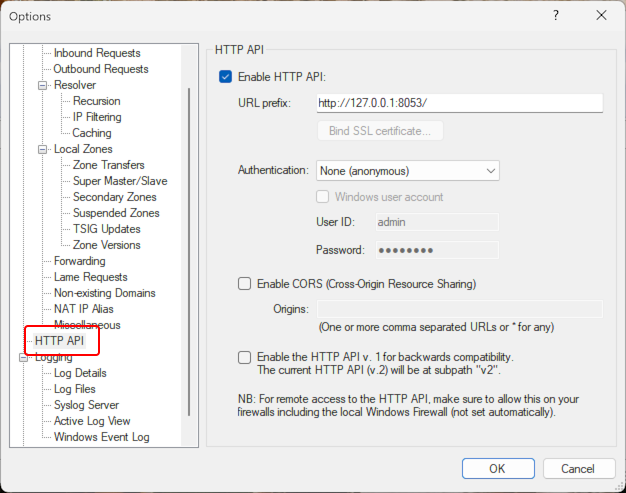

# Sending Simple DNS Plus HTTP Commands

Simple DNS Plus can be prompted to perform certain actions through HTTP - either directly from a browser or any other program that can communicate through HTTP.

If you are running Simple DNS Plus with the default configuration on the same computer that you are currently browsing from, [click here](http://127.0.0.1:8053/){target=_blank} to test with YOUR server (opens http://127.0.0.1:8053).

The settings related to this are configured in the Options dialog / HTTP API section:



Adjust these settings to match your IP addresses and security requirements.  
By default, it listens on IP 127.0.0.1 which means that connections can only be made from the same computer.

The different "commands" that Simple DNS Plus can accept through the HTTP API are listed and described in the help file "How to use the HTTP API" section. See [on-line version](https://simpledns.plus/helplink?p=ht_http).

The following are simple examples of program code that creates/updates a DNS A-record (host name = IP address).

Sample code in [JavaScript](#js), [Python](#python), and [C#](#cs):

### JavaScript{#js}

To use this sample code, simply copy the code below into notepad, save it as "test.mjs", and run it by typing `node test.mjs` at a command prompt.  
(Requires [Node.js](https://nodejs.org) v. 18 or later).

```javascript
let HostName="test.example.com";
let IPAddr="1.2.3.4";

const SdnsApiUrl="http://127.0.0.1:8053";
let r=await fetch(SdnsApiUrl +"/updatehost"+
  "?name=" + encodeURIComponent(HostName)+
  "&ip=" + encodeURIComponent(IPAddr), {
  method:"POST",
  // Un-comment the following line if you have enabled basic authentication for the HTTP API
  //headers: new Headers({"Authorization": `Basic ${btoa("userid:password")}`})
  });
if(r.ok){
  console.log("OK");
} else {
  console.log("Status: "+r.status + " " + r.statusText);
  console.log(await r.text());
}
```


### Python{#python}

To use this sample code, simply copy the code below into notepad, save it as "test.py", and run it by typing `py test.py` at a command prompt.  
(Requires [Python](https://python.org) with "py launcher" and the "requests" package installed).

```python
import requests

HostName="test.example.com"
IPAddr="1.2.3.14"
SdnsApiUrl="http://127.0.0.1:8053"

r = requests.post(SdnsApiUrl+"/updatehost?name=" + HostName + "&ip="+IPAddr)
# Comment the previous line and un-comment the following line if you have enabled basic authentication for the HTTP API
# r = requests.post(SdnsApiUrl+"/updatehost?name=" + HostName + "&ip="+IPAddr, auth = ('userid', 'password'))

if r.ok:
  print("OK")
else:
  print("Error")
```

### C#{#cs}

To use this sample code, simply copy the code below into notepad, save it as "test.cs", and run it by typing `dotnet run test.cs` at a command prompt.  
(Requires [.NET](https://dotnet.microsoft.com) v. 10 or later installed).

```csharp
var HostName="test.example.com";
var IPAddr="1.2.3.4";

var SdnsApiUrl="http://127.0.0.1:8053";

var req = new HttpRequestMessage(HttpMethod.Post, SdnsApiUrl + "/updatehost" +
   "?name=" + HostName +
   "&ip=" + IPAddr);
// Un-comment the following line if you have enabled basic authentication for the HTTP API
// req.Headers.Authorization = new("Basic",Convert.ToBase64String(System.Text.Encoding.UTF8.GetBytes("userid:password")));
var hc = new HttpClient();
var r=hc.Send(req);

Console.WriteLine(r.IsSuccessStatusCode ? "OK" : "Error: " + r.StatusCode); 
```
