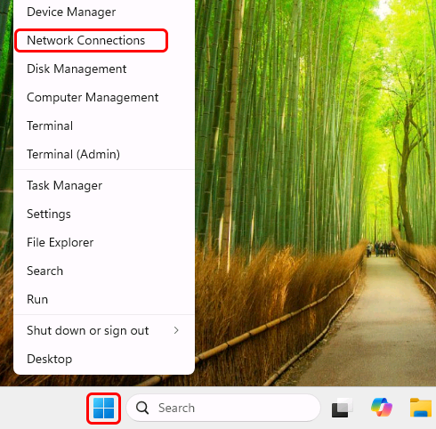
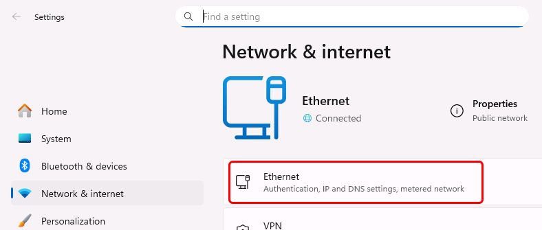
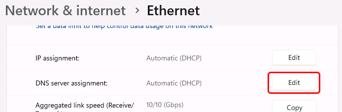
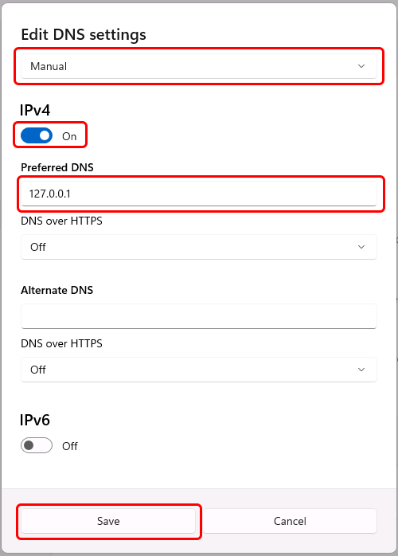

# Configuring Windows to use local DNS server (Windows 11 / Windows Server 2025)

Right-click the Windows Start button, and select "Network Connections":

Then in the "Settings" window, click your primary network connection:

Scroll down to "DNS server assignment" and click the "Edit" button:

In the "Edit DNS settings dialog", select "Manual" in the first drop-down, enable the "IPv4" switch, and enter the IP address of the local DNS server (*) as the Preferred DNS server:

Finally, click the "Save" button in this dialog to save your changes.

(*) The DNS server IP address must match an IP address that Simple DNS Plus is configured to listen on in the Options dialog / DNS / Inbound Requests section.  
If you are configuring the computer which Simple DNS Plus is running on, you can use 127.0.0.1 (the "localhost" address) - otherwise you must use an IP address which is accessible over the local area network.

